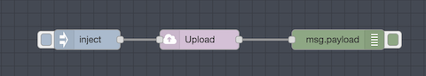
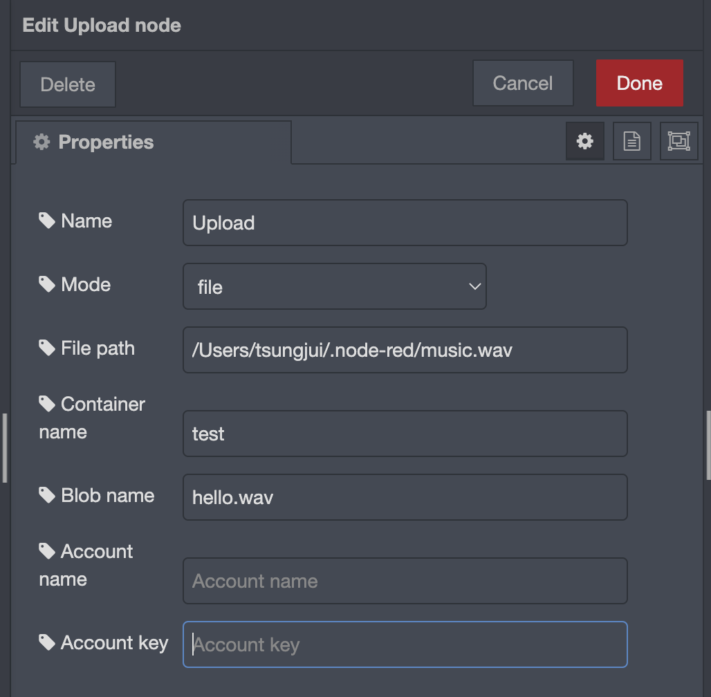
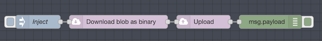
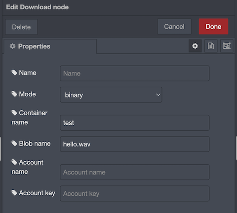
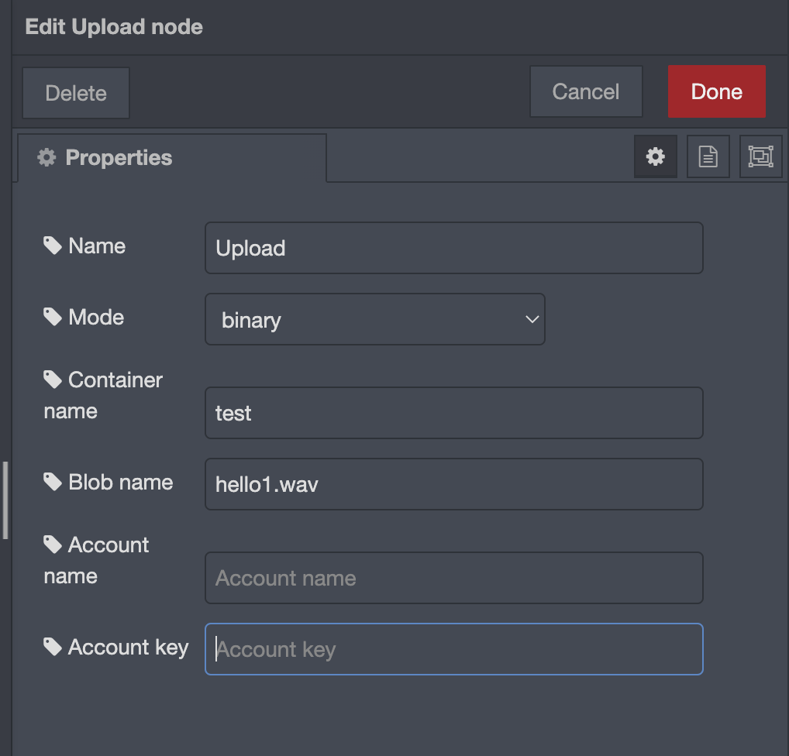

# node-red-azure-storage
## Introduction
**node-red-azure-storage** is a collection of nodes that perform uploading and downloading blob file from [Microsoft Azure Blob Storage](https://azure.microsoft.com/en-us/services/storage/blobs/).
## Installation
`npm install @intres/node-red-azure-storage`
## Example usage of Upload node
The example flow is shown as follows:

1. Drag the `Upload` node from section `azure-blob-storage`.
2. In the editor section, select which mode to use and complete required inputs. The example below
shows what the inputs should look like. In this example, under `file` mode, the `Upload` node will try to locate the file `/Users/tsungjui/.node-red/music.wav`, upload it to Azure Blob Storage, under container `test`
   and name the blob `hello.wav`.
   

For more information, check the help guide in node-red info tab.
3. Click Deploy in the top right corner.
4. Fire the inject node, and a response should be presented in the node-red debug tab.
   

## Example usage of Download node
The example flow is shown as follows:

In this example, we will download the blob `hello.wav` uploaded in the above example as binary content, and upload that binary content
to the container `test`, and name the blob `hello1.wav` using `Upload` node binary mode.

1. Drag `Upload` and `Download` node from section `azure-blob-storage`.
2. In the `Download` node's editor section, complete all the required inputs. In this example, we are trying to download the blob named `hello.wav` in container `test`
   as binary content(by selecting `binary` mode).
   
   
   
3. In the `Upload` node's editor section, complete all the required inputs. In this example, the node takes
   